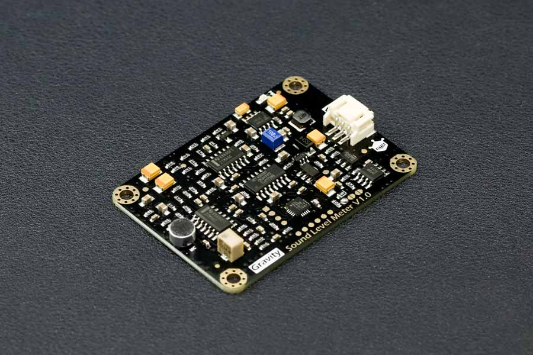

# E S P 3 2    —    D F R O B O T    A N A L O G    S O U N D    L E V E L    M E T E R

<https://www.dfrobot.com/product-1663.html>

<https://wiki.dfrobot.com/Gravity__Analog_Sound_Level_Meter_SKU_SEN0232>

<https://fr.aliexpress.com/item/32846247596.html?spm=a2g0s.9042311.0.0.61346c375GJr6S>

# PINOUT

| wire  |     signal      |
| ----- | :-------------: |
| green |  Analog output  |
| red   | VCC (3.3V - 5V) |
| black |       GND       |
